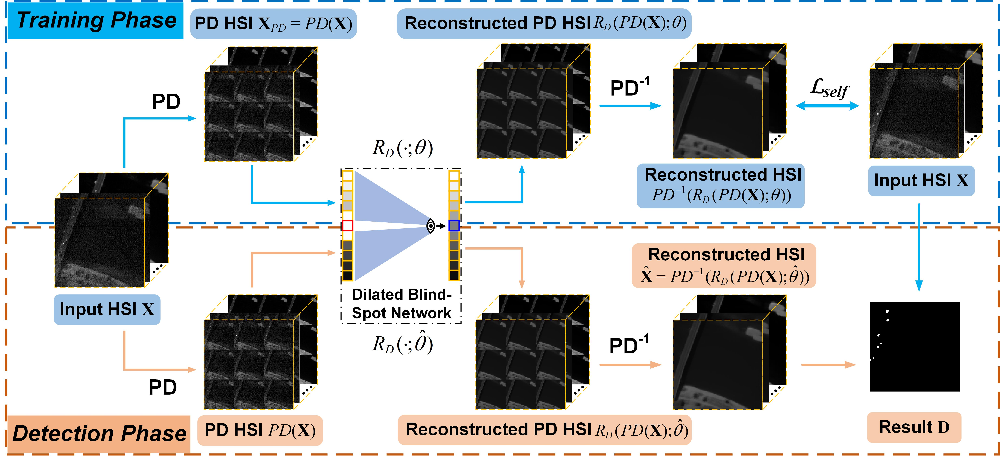

# PDBSNet
This is the official repository for  ["PDBSNet: Pixel-Shuffle Downsampling Blind-Spot Reconstruction Network for Hyperspectral Anomaly Detection"](https://ieeexplore.ieee.org/abstract/document/10124448) in IEEE Transactions on Geoscience and Remote Sensing (TGRS). 



## Abstract

Recent years have witnessed significant advances of deep learning technology in hyperspectral anomaly detection (HAD). Among these methods, existing unsupervised learning techniques that exploit image reconstruction errors to detect anomalous targets not only generate backgrounds but also reconstruct anomalies to a certain extent, thus failing to recognize anomalies from the original hyperspectral image (HSI). In order to train an efficient background reconstruction network, this article proposes a new pixel-shuffle downsampling blind-spot reconstruction network (called PDBSNet) that operates in a self-supervised fashion. On the one hand, PDBSNet adopts a blind-spot architecture with the receptive field, whose center pixel is set as a blind spot (meaning that the network is unable to see the center pixel), and reconstructs the spectral information of the center pixel using its neighbors. Given that the spectral signatures of anomalous targets are significantly different from those of neighboring pixels, our network tends to generate high reconstruction errors for anomalous pixels and low reconstruction errors for background pixels, and the above characterization of blind-spot architecture is well-suited for the HAD task. On the other hand, we introduce the pixel-shuffle downsampling (PD) technique, which extends the application range of the blind-spot framework due to the fact that it breaks the spatial correlation between pixels in anomalous targets and improves the discrimination between the anomalous pixels and shuffled neighboring backgrounds. Taken together, our PDBSNet integrates the blind-spot architecture and the PD strategy, effectively enhancing the feature representation of the background and weakening the feature expression of anomalies. It is expected to increase the reconstruction error of anomalous objects, while the differences between the original HSI and the reconstructed one are taken as anomaly scores. Extensive experiments on four datasets reveal that PDBSNet is competitive and remarkable concerning other state-of-the-art detectors.

## Setup

### Requirements

Our experiments are done with:

- Python 3.9.12
- PyTorch 1.12.1
- numpy 1.21.5
- scipy 1.7.3
- torchvision 0.13.1

## Prepare Dataset

Put the data(.mat [data, map]) into ./data

## Training and Testing

### Training
```shell
python main.py --command train --dataset HSI-II --epochs 3000 --learning_rate 1e-4 --factor_train 3 --factor_test 3 --gpu_ids 0
```

### Testing
```shell
python main.py --command predict --dataset HSI-II --epochs 3000 --learning_rate 1e-4 --factor_train 3 --factor_test 3 --gpu_ids 0
```

- If you want to Train and Test your own data, you can change the input dataset name (dataset) and tune the parameters, such as Learning rate (learning_rate), PD stride factor (factor_train, factor_test).

## Citation

If the work or the code is helpful, please cite the paper:

```
@article{wang2023pdbsnet,
  author={Wang, Degang and Zhuang, Lina and Gao, Lianru and Sun, Xu and Huang, Min and Plaza, Antonio},
  journal={IEEE Trans. Geosci. Remote Sens.}, 
  title={{PDBSNet}: Pixel-Shuffle Downsampling Blind-Spot Reconstruction Network for Hyperspectral Anomaly Detection}, 
  year={2023},
  volume={61},
  pages={1-14},
  DOI={10.1109/TGRS.2023.3276175}
}
```

## Acknowledgement

The codes are based on [AP-BSN](https://github.com/wooseoklee4/AP-BSN). Thanks for their awesome work.

## Contact
For further questions or details, please directly reach out to wangdegang20@mails.ucas.ac.cn
